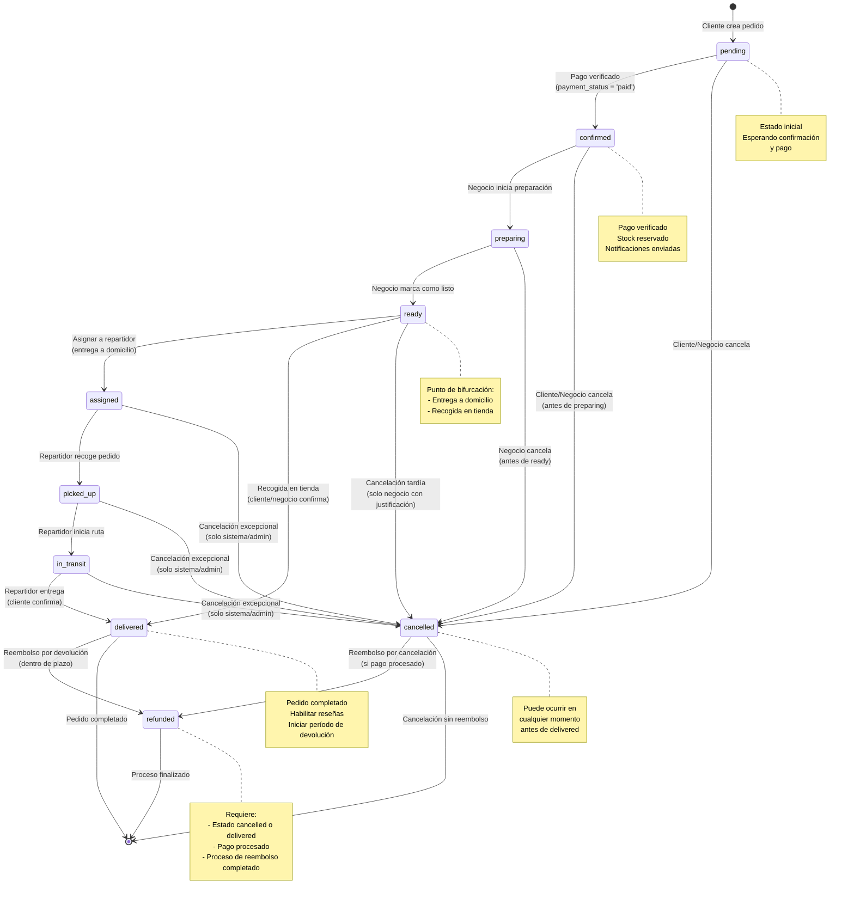

# Proceso de Seguimiento de Pedidos y Políticas de Postventa

## 📋 Resumen Ejecutivo

Este documento define el ciclo de vida completo de un pedido desde su creación hasta su entrega, incluyendo las reglas de negocio para transiciones entre estados, políticas de cancelación, devolución y reembolso, y las modificaciones necesarias en la base de datos para soportar estos procesos.

---

## 📊 Diagrama de Flujo de Estados del Pedido

### Leyenda del Diagrama

- **Flechas negras**: Transiciones normales del flujo
- **Flechas rojas**: Transiciones de cancelación
- **Flechas verdes**: Transiciones de reembolso
- **Notas**: Información adicional sobre estados clave

---

## 🎯 Estados del Pedido (Order Status)
