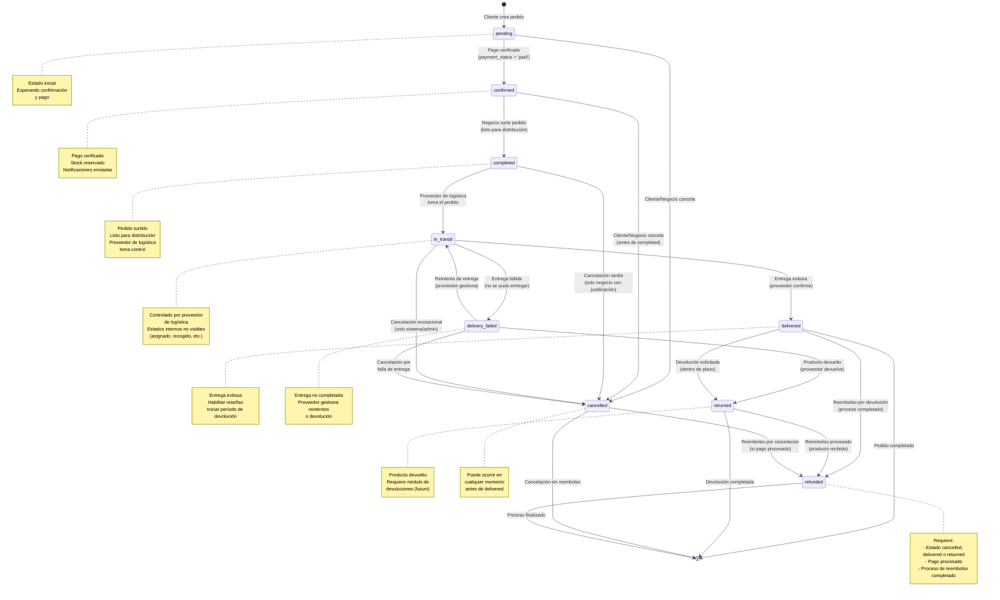

# Proceso de Seguimiento de Pedidos y Políticas de Postventa

## 📋 Resumen Ejecutivo

Este documento define el ciclo de vida completo de un pedido desde su creación hasta su entrega, incluyendo las reglas de negocio para transiciones entre estados, políticas de cancelación, devolución y reembolso, y las modificaciones necesarias en la base de datos para soportar estos procesos.

---

## 📊 Diagrama de Flujo de Estados del Pedido

### Leyenda del Diagrama

- **Flechas negras**: Transiciones normales del flujo
- **Flechas rojas**: Transiciones de cancelación
- **Flechas verdes**: Transiciones de reembolso
- **Flechas azules**: Transiciones gestionadas por proveedor de logística
- **Notas**: Información adicional sobre estados clave

---

## 🎯 Estados del Pedido (Order Status)

### Estados Principales

| Estado | Descripción | Controlado Por | Acciones Disponibles |
|--------|-------------|---------------|---------------------|
| **pending** | Pedido creado, esperando confirmación y pago | Sistema | Confirmar pago, Cancelar |
| **confirmed** | Pago verificado, stock reservado | Negocio | Marcar como completado, Cancelar |
| **completed** | Pedido surtido, listo para distribución | Negocio | Entregar a proveedor de logística |
| **in_transit** | En manos del proveedor de logística | Proveedor | Estados internos no visibles (asignado, recogido, en ruta) |
| **delivered** | Entregado exitosamente al cliente | Proveedor | Solicitar devolución, Procesar reembolso |
| **delivery_failed** | Entrega fallida (no se pudo entregar) | Proveedor | Reintentar entrega, Devolver producto, Cancelar |
| **returned** | Producto devuelto al negocio | Sistema/Negocio | Procesar reembolso |
| **cancelled** | Pedido cancelado | Cliente/Negocio/Sistema | Procesar reembolso (si aplica) |
| **refunded** | Reembolso procesado | Sistema | Finalizar proceso |

### Cambios Implementados

#### Estados Eliminados
- ❌ **preparing**: Estado muy momentáneo, eliminado
- ❌ **ready**: Controlado por proveedor de logística
- ❌ **assigned**: Controlado por proveedor de logística
- ❌ **picked_up**: Controlado por proveedor de logística

#### Estados Nuevos
- ✅ **completed**: Reemplaza `preparing` y `ready`. Indica que el pedido está surtido y listo para distribución
- ✅ **delivery_failed**: Indica que la entrega no se pudo completar
- ✅ **returned**: Indica que el producto fue devuelto (requiere módulo de devoluciones futuro)

#### Estados Modificados
- 🔄 **in_transit**: Ahora congrega todos los estados del proveedor de logística (asignado, recogido, en ruta, etc.)

### Reglas de Transición

#### Flujo Principal
1. **pending** → **confirmed** (requiere `payment_status = 'paid'`)
2. **confirmed** → **completed** (negocio marca como surtido)
3. **completed** → **in_transit** (proveedor de logística toma control)
4. **in_transit** → **delivered** | **delivery_failed**
5. **delivery_failed** → **in_transit** (reintento) | **returned** | **cancelled**
6. **delivered** → **returned** (devolución) | **refunded** (reembolso)
7. **returned** → **refunded** (reembolso procesado)

#### Cancelaciones
- **pending** → **cancelled** (en cualquier momento)
- **confirmed** → **cancelled** (antes de `completed`)
- **completed** → **cancelled** (solo negocio con justificación)
- **in_transit** → **cancelled** (solo sistema/admin, excepcional)

#### Reembolsos
- **cancelled** → **refunded** (si pago procesado)
- **delivered** → **refunded** (por devolución)
- **returned** → **refunded** (proceso completado)

### Responsabilidades por Estado

#### Controlado por Negocio
- `pending` → `confirmed` (confirmar pago)
- `confirmed` → `completed` (surtir pedido)
- `completed` → `in_transit` (entregar a proveedor)

#### Controlado por Proveedor de Logística
- `completed` → `in_transit` (tomar pedido)
- `in_transit` → `delivered` (entregar exitosamente)
- `in_transit` → `delivery_failed` (falla en entrega)
- `delivery_failed` → `in_transit` (reintentar)
- `delivery_failed` → `returned` (devolver producto)

#### Controlado por Sistema/Cliente
- `delivered` → `returned` (solicitar devolución)
- `returned` → `refunded` (procesar reembolso)
- Cualquier estado → `cancelled` (según reglas)

### Notas Importantes

1. **Estados del Proveedor de Logística**: Los estados internos del proveedor (asignado, recogido, en ruta) no son visibles en nuestro sistema. Solo vemos `in_transit` como estado general.

2. **Módulo de Devoluciones**: El estado `returned` requiere un módulo de devoluciones completo que se implementará en el futuro. Por ahora, es un estado terminal que permite procesar reembolsos.

3. **Reintentos de Entrega**: El proveedor de logística gestiona los reintentos. Nuestro sistema solo ve `delivery_failed` → `in_transit` cuando hay un reintento.

4. **Cancelaciones Tardías**: Después de `completed`, las cancelaciones requieren justificación del negocio y pueden tener costos asociados.

---

**Anterior:** [22. Roles de Negocio e Interfaces Diferenciadas](./22-roles-negocio-interfaces-diferenciadas.md)

**Siguiente:** [24. Configuración de Políticas RLS para Supabase Storage Buckets](./24-configuracion-storage-buckets.md)

**Volver al inicio:** [README Principal](./README.md)
