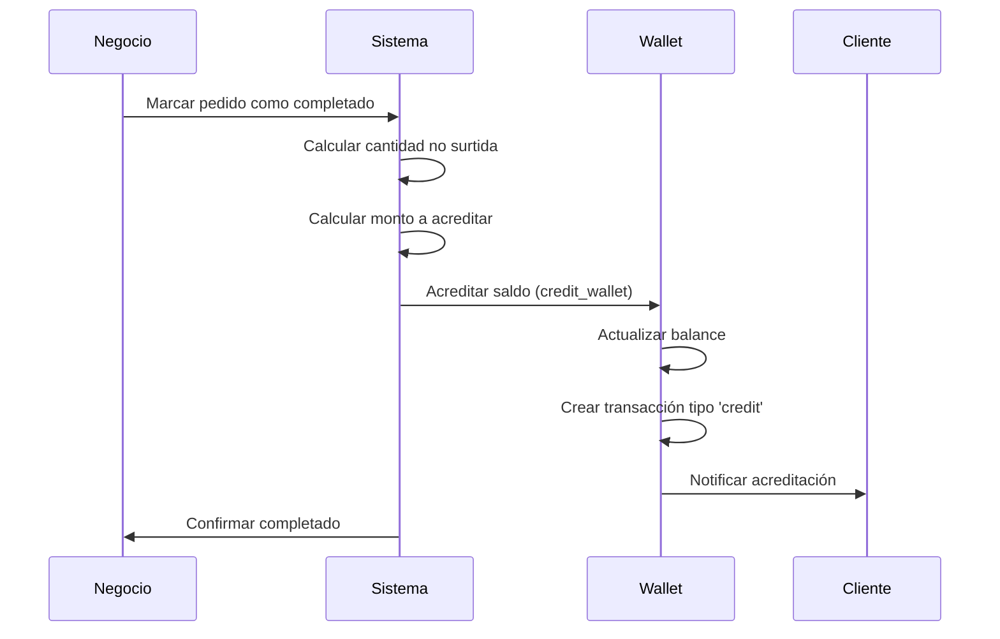
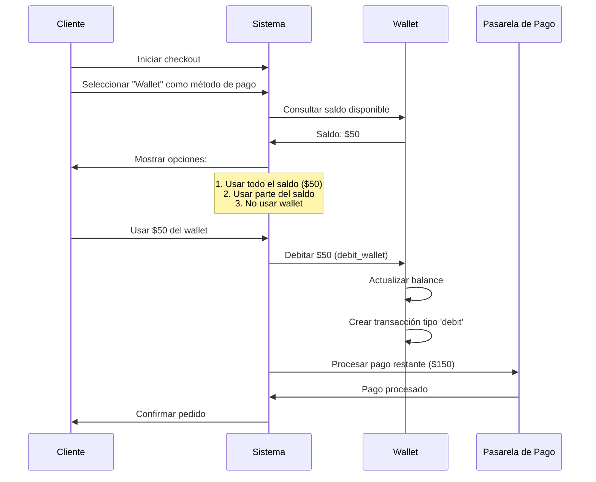

# Sistema de Monedero Electrónico (Wallet)

## 📋 Resumen Ejecutivo

Este documento describe el sistema completo de monedero electrónico integrado en LOCALIA, que permite a los usuarios:
- Recibir créditos (notas de crédito) cuando no se surte la cantidad completa de un pedido
- Usar el saldo del wallet como método de pago
- Realizar pagos parciales combinando wallet + otro método de pago
- Consultar el historial completo de movimientos (entradas y salidas)

---

## 🎯 Casos de Uso

### 1. Nota de Crédito por Falta de Stock

**Escenario**: Cliente pidió 3 unidades de un producto a $100 c/u (total $300), pero solo se surtieron 2 unidades.

**Proceso**:
1. Al marcar como completado, el sistema detecta que faltó surtir 1 unidad
2. Se calcula el monto a acreditar: 1 unidad × $100 = $100
3. Se acredita automáticamente al wallet del cliente
4. Se registra una transacción tipo `credit` con razón: "Nota de crédito por falta de stock"

**Resultado**: Cliente tiene $100 en su wallet para usar en futuras compras.

### 2. Pago con Wallet

**Escenario**: Cliente tiene $50 en su wallet y quiere comprar productos por $200.

**Proceso**:
1. Cliente selecciona "Wallet" como método de pago
2. Sistema verifica saldo disponible ($50)
3. Cliente puede:
   - Usar todo el saldo ($50) y pagar el resto ($150) con otro método
   - O usar solo una parte del saldo
4. Se registran transacciones tipo `debit` por el monto usado

**Resultado**: Pago distribuido entre wallet y otro método.

### 3. Consulta de Historial

**Escenario**: Cliente quiere ver todos sus movimientos de wallet.

**Proceso**:
1. Cliente accede a su historial de wallet
2. Ve todas las transacciones ordenadas por fecha (más recientes primero)
3. Cada transacción muestra:
   - Tipo (crédito, débito, reembolso)
   - Monto
   - Saldo antes y después
   - Razón/descripción
   - Fecha y hora

---

## 🗄️ Estructura de Base de Datos

### Tabla: `commerce.user_wallets`

Almacena el saldo actual de cada usuario.

| Campo | Tipo | Descripción |
|-------|------|-------------|
| `id` | UUID | ID único del wallet |
| `user_id` | UUID | Referencia al usuario (UNIQUE) |
| `balance` | DECIMAL(10,2) | Saldo actual (siempre >= 0) |
| `is_active` | BOOLEAN | Si el wallet está activo |
| `is_blocked` | BOOLEAN | Si el wallet está bloqueado |
| `created_at` | TIMESTAMP | Fecha de creación |
| `updated_at` | TIMESTAMP | Última actualización |

**Constraints**:
- Un usuario solo puede tener un wallet (`UNIQUE(user_id)`)
- El saldo siempre debe ser >= 0

### Tabla: `commerce.wallet_transactions`

Registra todos los movimientos del wallet para auditoría.

| Campo | Tipo | Descripción |
|-------|------|-------------|
| `id` | UUID | ID único de la transacción |
| `wallet_id` | UUID | Referencia al wallet |
| `user_id` | UUID | Referencia al usuario |
| `transaction_type` | ENUM | Tipo: `credit`, `debit`, `refund`, `payment`, `adjustment` |
| `amount` | DECIMAL(10,2) | Monto de la transacción (> 0) |
| `status` | ENUM | Estado: `pending`, `completed`, `failed`, `cancelled` |
| `balance_before` | DECIMAL(10,2) | Saldo antes de la transacción |
| `balance_after` | DECIMAL(10,2) | Saldo después de la transacción |
| `order_id` | UUID | Referencia al pedido (opcional) |
| `order_item_id` | UUID | Referencia al item del pedido (opcional) |
| `description` | TEXT | Descripción general |
| `reason` | TEXT | Razón específica (ej: "Nota de crédito por falta de stock de 1 unidad") |
| `created_by_user_id` | UUID | Usuario que creó la transacción |
| `created_by_role` | user_role | Rol del usuario que creó la transacción |
| `created_at` | TIMESTAMP | Fecha de creación |
| `updated_at` | TIMESTAMP | Última actualización |

**Tipos de Transacción**:
- `credit`: Acreditación (entrada de dinero) - Nota de crédito, reembolso
- `debit`: Débito (salida de dinero) - Pago con wallet
- `refund`: Reembolso al wallet
- `payment`: Pago usando wallet (similar a debit, pero más específico)
- `adjustment`: Ajuste manual (solo admin)

---

## 🔄 Flujos de Integración

### Flujo 1: Acreditación por Falta de Stock



**Ejemplo**:
- Pedido: 3 unidades × $100 = $300
- Surtido: 2 unidades
- No surtido: 1 unidad × $100 = $100
- Se acredita $100 al wallet del cliente

### Flujo 2: Pago con Wallet (Parcial o Total)



**Ejemplo**:
- Total del pedido: $200
- Saldo en wallet: $50
- Cliente usa $50 del wallet
- Resto ($150) se paga con tarjeta/efectivo
- Se registran 2 transacciones: 1 débito del wallet + 1 pago externo

---

## 🔌 Integración con Preparación de Pedidos

### Modificación en `prepareOrder`

Cuando se marca un pedido como completado y hay productos no surtidos:

1. **Calcular monto a acreditar**:
   ```typescript
   for (const shortageOption of shortageOptions) {
     if (shortageOption.option_type === 'wallet') {
       const item = order.items.find(i => i.product_id === shortageOption.product_id);
       const amountToCredit = item.item_price * shortageOption.shortage_quantity;
       
       // Acreditar al wallet
       await walletService.creditWallet(userId, amountToCredit, {
         reason: `Nota de crédito por falta de stock: ${shortageOption.shortage_quantity} unidades de ${item.item_name}`,
         order_id: orderId,
         order_item_id: item.id
       });
     }
   }
   ```

2. **Registrar en historial**: La transacción se registra automáticamente con toda la información.

---

## 💳 Integración con Checkout

### Modificación en `checkout`

1. **Validar método de pago**:
   ```typescript
   if (paymentMethod === 'wallet' || paymentMethod.includes('wallet')) {
     // Verificar saldo disponible
     const wallet = await walletService.getWallet(userId);
     const availableBalance = wallet.balance;
     
     // Calcular cuánto se puede pagar con wallet
     const walletPaymentAmount = Math.min(availableBalance, totalAmount);
     const remainingAmount = totalAmount - walletPaymentAmount;
     
     // Si hay saldo suficiente, usar todo
     if (walletPaymentAmount >= totalAmount) {
       await walletService.debitWallet(userId, totalAmount, {
         reason: 'Pago completo de pedido',
         order_id: orderId
       });
     } else {
       // Pago parcial con wallet + otro método
       await walletService.debitWallet(userId, walletPaymentAmount, {
         reason: `Pago parcial de pedido (${walletPaymentAmount} de ${totalAmount})`,
         order_id: orderId
       });
       
       // Procesar pago restante con otro método
       await processPayment(remainingAmount, otherPaymentMethod);
     }
   }
   ```

2. **Distribución de pago**:
   - Si el wallet cubre todo: Solo se debita del wallet
   - Si el wallet cubre parcialmente: Se debita del wallet + se procesa el resto con otro método
   - Si no hay saldo: Se procesa todo con otro método

---

## 📊 Consulta de Historial

### Endpoint: `GET /api/wallet/balance`
Retorna el saldo actual del usuario.

**Respuesta**:
```json
{
  "wallet_id": "uuid",
  "user_id": "uuid",
  "balance": 150.00,
  "is_active": true,
  "is_blocked": false,
  "last_transaction_at": "2025-01-XX..."
}
```

### Endpoint: `GET /api/wallet/transactions`
Retorna el historial de transacciones.

**Parámetros**:
- `page`: Número de página (default: 1)
- `limit`: Items por página (default: 20)
- `type`: Filtrar por tipo (`credit`, `debit`, etc.)
- `status`: Filtrar por estado

**Respuesta**:
```json
{
  "data": [
    {
      "id": "uuid",
      "transaction_type": "credit",
      "amount": 100.00,
      "status": "completed",
      "balance_before": 50.00,
      "balance_after": 150.00,
      "description": "Acreditación de saldo",
      "reason": "Nota de crédito por falta de stock: 1 unidades de Producto X",
      "order_id": "uuid",
      "created_at": "2025-01-XX...",
      "created_by_role": "admin"
    }
  ],
  "pagination": {
    "total": 10,
    "page": 1,
    "limit": 20,
    "totalPages": 1
  }
}
```

---

## 🔒 Seguridad y Validaciones

### Validaciones de Acreditación

1. **Monto válido**: El monto a acreditar debe ser > 0
2. **Wallet activo**: El wallet debe estar activo y no bloqueado
3. **Usuario válido**: El usuario debe existir y estar activo

### Validaciones de Débito

1. **Saldo suficiente**: El saldo disponible debe ser >= monto a debitar
2. **Wallet activo**: El wallet debe estar activo y no bloqueado
3. **Monto válido**: El monto a debitar debe ser > 0

### Transacciones Atómicas

Todas las operaciones de wallet se realizan en transacciones de base de datos para garantizar:
- Consistencia del saldo
- Registro correcto de transacciones
- Rollback en caso de error

---

## 📝 Ejemplos de Uso

### Ejemplo 1: Acreditación por Falta de Stock

```sql
-- Cuando se marca como completado y faltó surtir 1 unidad de $100
SELECT commerce.credit_wallet(
    p_user_id := 'user-uuid',
    p_amount := 100.00,
    p_reason := 'Nota de crédito por falta de stock: 1 unidad de Producto X',
    p_description := 'Acreditación automática por producto no surtido',
    p_order_id := 'order-uuid',
    p_order_item_id := 'item-uuid',
    p_created_by_role := 'admin'
);
```

### Ejemplo 2: Pago Parcial con Wallet

```sql
-- Cliente tiene $50 en wallet, pedido de $200
-- Usa $50 del wallet, resto se paga con tarjeta

-- Paso 1: Debitar del wallet
SELECT commerce.debit_wallet(
    p_user_id := 'user-uuid',
    p_amount := 50.00,
    p_reason := 'Pago parcial de pedido (50.00 de 200.00)',
    p_order_id := 'order-uuid',
    p_created_by_role := 'client'
);

-- Paso 2: Procesar pago restante ($150) con tarjeta (fuera del scope del wallet)
```

### Ejemplo 3: Consulta de Saldo

```sql
-- Obtener saldo actual
SELECT balance, is_active, is_blocked
FROM commerce.user_wallets
WHERE user_id = 'user-uuid';
```

---

## 🚀 Implementación Backend

### Servicio: `WalletService`

```typescript
@Injectable()
export class WalletService {
  async getWallet(userId: string): Promise<Wallet>
  async getBalance(userId: string): Promise<number>
  async creditWallet(userId: string, amount: number, metadata: CreditMetadata): Promise<WalletTransaction>
  async debitWallet(userId: string, amount: number, metadata: DebitMetadata): Promise<WalletTransaction>
  async getTransactions(userId: string, filters: TransactionFilters): Promise<TransactionList>
  async canUseWallet(userId: string, amount: number): Promise<boolean>
}
```

### Controlador: `WalletController`

```typescript
@Controller('wallet')
export class WalletController {
  @Get('balance')
  async getBalance(@CurrentUser() user: User)
  
  @Get('transactions')
  async getTransactions(@CurrentUser() user: User, @Query() filters)
  
  @Post('credit')
  async creditWallet(@CurrentUser() user: User, @Body() data)
  
  @Post('debit')
  async debitWallet(@CurrentUser() user: User, @Body() data)
}
```

---

## 🎨 Implementación Frontend

### Componente: Wallet Balance

```typescript
// Mostrar saldo actual
const { balance, isLoading } = useWalletBalance();

return (
  <div>
    <h3>Tu Saldo</h3>
    <p className="text-2xl font-bold">${balance.toFixed(2)}</p>
  </div>
);
```

### Componente: Payment Method Selector

```typescript
// En checkout, permitir seleccionar wallet como método de pago
const paymentMethods = [
  { value: 'card', label: 'Tarjeta' },
  { value: 'cash', label: 'Efectivo' },
  { value: 'wallet', label: `Wallet (Saldo: $${balance})` },
  { value: 'wallet_partial', label: `Wallet + Otro método` }
];
```

### Componente: Transaction History

```typescript
// Mostrar historial de transacciones
const { transactions, isLoading } = useWalletTransactions();

return (
  <table>
    <thead>
      <tr>
        <th>Fecha</th>
        <th>Tipo</th>
        <th>Monto</th>
        <th>Saldo Antes</th>
        <th>Saldo Después</th>
        <th>Razón</th>
      </tr>
    </thead>
    <tbody>
      {transactions.map(tx => (
        <tr key={tx.id}>
          <td>{formatDate(tx.created_at)}</td>
          <td>{tx.transaction_type}</td>
          <td>${tx.amount}</td>
          <td>${tx.balance_before}</td>
          <td>${tx.balance_after}</td>
          <td>{tx.reason}</td>
        </tr>
      ))}
    </tbody>
  </table>
);
```

---

## 📋 Checklist de Implementación

### Backend
- [x] Crear migración SQL para tablas de wallet
- [ ] Crear servicio `WalletService` con métodos:
  - [ ] `getWallet(userId)`
  - [ ] `getBalance(userId)`
  - [ ] `creditWallet(userId, amount, metadata)`
  - [ ] `debitWallet(userId, amount, metadata)`
  - [ ] `getTransactions(userId, filters)`
- [ ] Crear controlador `WalletController` con endpoints
- [ ] Integrar con `prepareOrder` para acreditar saldo
- [ ] Integrar con `checkout` para permitir pago con wallet
- [ ] Agregar validaciones y manejo de errores

### Frontend
- [ ] Crear servicio `walletService` en `lib/wallet.ts`
- [ ] Crear componente `WalletBalance` para mostrar saldo
- [ ] Crear componente `WalletTransactions` para historial
- [ ] Agregar "Wallet" como opción de método de pago en checkout
- [ ] Implementar lógica de pago parcial (wallet + otro método)
- [ ] Mostrar notificaciones cuando se acredita saldo

### Base de Datos
- [x] Crear tabla `commerce.user_wallets`
- [x] Crear tabla `commerce.wallet_transactions`
- [x] Crear funciones SQL: `credit_wallet`, `debit_wallet`
- [x] Crear triggers para crear wallet automáticamente
- [ ] Ejecutar migración en base de datos

---

## 🔗 Referencias

- **Migración SQL**: `database/migrations/migration_create_wallet_system.sql`
- **Documentación de Checkout**: `docs/PROCESO_CHECKOUT_MULTI_SUCURSAL.md`
- **Documentación de Preparación**: `docs/23-proceso-seguimiento-pedidos-postventa.md`

---

**Anterior:** [23. Proceso de Seguimiento de Pedidos y Postventa](./23-proceso-seguimiento-pedidos-postventa.md)

**Siguiente:** [26. (Próximo documento)]

**Volver al inicio:** [README Principal](./README.md)

