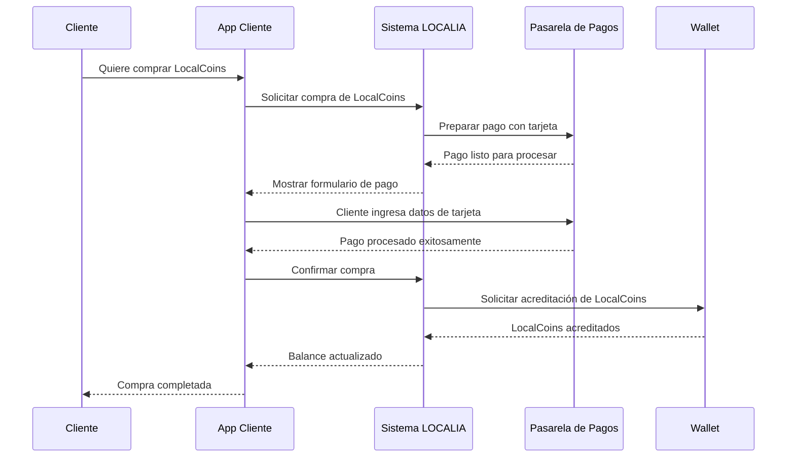

# 🎯 Alcance MVP - LOCALIA Admin

**Versión:** 1.0  
**Fecha:** Noviembre 2025  
**Audiencia:** Product Owner, Equipo Operativo, Stakeholders

---

## 📋 Resumen Ejecutivo

Este documento define el **alcance mínimo viable (MVP)** del sistema LOCALIA, una plataforma de delivery hiperlocal (radio 3 km) que conecta clientes, negocios locales y repartidores mediante un ecosistema de créditos digitales (LocalCoins).

### Objetivo del MVP

Entregar un sistema funcional end-to-end que permita:
- ✅ Clientes realicen pedidos y paguen con LocalCoins
- ✅ Negocios gestionen menú, reciban y procesen pedidos
- ✅ Repartidores acepten y entreguen pedidos
- ✅ Administradores gestionen el sistema y usuarios
- ✅ Integración con Wallet externo para transacciones financieras
- ✅ Integración con pasarela de pagos para compra de LocalCoins

---

## 👥 Roles y Actores del Sistema

### 1. **Cliente** (`client`)
- Usuario final que realiza pedidos
- Compra LocalCoins para pagar pedidos
- Rastrea entregas en tiempo real
- Deja reseñas y propinas

### 2. **Repartidor** (`repartidor`)
- Acepta/rechaza pedidos disponibles
- Actualiza estado de entregas
- Visualiza ganancias y historial

### 3. **Negocio Local** - Roles de Negocio

#### 3.1. **Superadmin** (`superadmin`)
- Acceso completo al negocio
- Gestiona usuarios y permisos
- Configuración del negocio

#### 3.2. **Admin** (`admin`)
- Gestión completa de productos y precios
- Gestión de promociones
- Gestión de órdenes
- Estadísticas y reportes

#### 3.3. **Operations Staff** (`operations_staff`)
- Panel operativo independiente
- Acepta pedidos (pending → confirmed)
- Actualiza estados (confirmed → preparing → ready)
- Gestiona entregas cuando llega repartidor

#### 3.4. **Kitchen Staff** (`kitchen_staff`) (opcional)
- Interfaz aislada para cocina
- Solo ve órdenes confirmadas
- Marca órdenes como "en preparación" y "listas"

### 4. **Administrador del Sistema** (`admin`)
- Panel de administración completo
- Gestión de usuarios y negocios
- Métricas y analytics globales
- Configuración del sistema
- Gestión de catálogos y categorías

---

## 🔄 Diagrama de Procesos Principal

### Flujo Completo: Cliente → Local → Repartidor

```mermaid
graph TB
    Start([Cliente inicia sesión]) --> Browse[Explorar negocios disponibles]
    Browse --> Select[Seleccionar negocio y productos]
    Select --> Cart[Agregar al carrito]
    Cart --> Checkout[Proceso de checkout]
    
    Checkout --> Address[Seleccionar dirección de entrega]
    Address --> Delivery[Configurar entrega y propina]
    Delivery --> Payment[Seleccionar método de pago]
    
    Payment --> WalletCheck{¿Tiene LocalCoins<br/>suficientes?}
    WalletCheck -->|No| BuyLC[Comprar LocalCoins<br/>via Pasarela de Pagos]
    BuyLC --> WalletAPI[Wallet: Acreditar LCs]
    WalletCheck -->|Sí| ProcessPayment[Procesar pago con LCs]
    BuyLC --> ProcessPayment
    
    ProcessPayment --> WalletAPI2[Wallet: Debitar LCs<br/>del cliente]
    WalletAPI2 --> CreateOrder[Crear pedido<br/>Estado: PENDING]
    
    CreateOrder --> NotifyLocal[Notificar al Local]
    NotifyLocal --> LocalView[Local ve pedido pendiente]
    
    LocalView --> AcceptOrder{¿Acepta pedido?}
    AcceptOrder -->|No| CancelOrder[Cancelar pedido<br/>Estado: CANCELLED]
    CancelOrder --> Refund[Wallet: Reembolsar LCs]
    Refund --> EndCancel([Fin: Pedido cancelado])
    
    AcceptOrder -->|Sí| ConfirmOrder[Confirmar pedido<br/>Estado: CONFIRMED]
    ConfirmOrder --> NotifyClient[Notificar cliente]
    
    ConfirmOrder --> Kitchen{¿Rol Kitchen Staff?}
    Kitchen -->|Sí| KitchenView[Kitchen ve orden confirmada]
    KitchenView --> StartPrep[Iniciar preparación<br/>Estado: PREPARING]
    StartPrep --> FinishPrep[Terminar preparación<br/>Estado: READY]
    FinishPrep --> ReadyNotify[Notificar: Orden lista]
    
    Kitchen -->|No| OperationsView[Operations ve orden]
    OperationsView --> OperationsPrep[Poner en preparación<br/>Estado: PREPARING]
    OperationsPrep --> OperationsReady[Marcar como listo<br/>Estado: READY]
    
    ReadyNotify --> AssignRepartidor[Asignar a Repartidor]
    OperationsReady --> AssignRepartidor
    
    AssignRepartidor --> RepartidorView[Repartidor ve pedido disponible]
    RepartidorView --> AcceptDelivery{¿Acepta entrega?}
    AcceptDelivery -->|No| WaitRepartidor[Esperar otro repartidor]
    WaitRepartidor --> RepartidorView
    
    AcceptDelivery -->|Sí| PickUp[Recoger pedido<br/>Estado: PICKED_UP]
    PickUp --> InTransit[En camino<br/>Estado: IN_TRANSIT]
    InTransit --> Deliver[Entregar pedido<br/>Estado: DELIVERED]
    
    Deliver --> WalletPayLocal[Wallet: Pagar al Local]
    Deliver --> WalletPayRepartidor[Wallet: Pagar al Repartidor]
    Deliver --> WalletPayTip[Wallet: Pagar propina]
    
    WalletPayLocal --> CompleteOrder[Pedido completado]
    WalletPayRepartidor --> CompleteOrder
    WalletPayTip --> CompleteOrder
    
    CompleteOrder --> Review[Cliente puede dejar reseña]
    Review --> End([Fin: Pedido entregado])
    
    style Start fill:#f5f5f5,stroke:#333,stroke-width:2px
    style End fill:#f5f5f5,stroke:#333,stroke-width:2px
    style EndCancel fill:#f0f0f0,stroke:#999,stroke-width:2px
    style WalletAPI fill:#f5f5f5,stroke:#666,stroke-width:1px
    style WalletAPI2 fill:#f5f5f5,stroke:#666,stroke-width:1px
    style WalletPayLocal fill:#f5f5f5,stroke:#666,stroke-width:1px
    style WalletPayRepartidor fill:#f5f5f5,stroke:#666,stroke-width:1px
    style WalletPayTip fill:#f5f5f5,stroke:#666,stroke-width:1px
    style Refund fill:#f0f0f0,stroke:#999,stroke-width:1px
```

---

## 🏗️ Funcionalidades del MVP

### 📱 **App Cliente (Web)**

#### Autenticación y Perfil
- ✅ Registro e inicio de sesión
- ✅ Gestión de perfil
- ✅ Gestión de direcciones de entrega

#### Catálogo y Pedidos
- ✅ Explorar negocios disponibles (radio 3 km)
- ✅ Ver menú de negocios
- ✅ Agregar productos al carrito
- ✅ Proceso de checkout (3 pasos: dirección, entrega, pago)
- ✅ Selección de método de pago (LocalCoins)
- ✅ Seguimiento de pedidos en tiempo real
- ✅ Historial de pedidos

#### Wallet y Pagos
- ✅ Ver balance de LocalCoins
- ✅ Comprar LocalCoins (integración con pasarela de pagos)
- ✅ Historial de transacciones
- ✅ Pago con LocalCoins en checkout

#### Evaluaciones
- ✅ Dejar reseñas después de entrega
- ✅ Agregar propinas (opcional)

---

### 🏪 **App Local (Web)**

#### Autenticación y Configuración
- ✅ Registro e inicio de sesión
- ✅ Gestión de perfil del negocio
- ✅ Selección de negocio (multi-tienda)

#### Gestión de Productos (Admin/Superadmin)
- ✅ Crear, editar, eliminar productos
- ✅ Gestión de categorías y colecciones
- ✅ Configurar precios y variantes
- ✅ Gestión de impuestos configurables
- ✅ Configurar disponibilidad y horarios

#### Gestión de Órdenes

**Operations Staff:**
- ✅ Panel operativo con vista Kanban
- ✅ Aceptar pedidos (pending → confirmed)
- ✅ Actualizar estados (confirmed → preparing → ready)
- ✅ Gestionar entregas (picked_up → delivered)
- ✅ Cancelar pedidos con razón
- ✅ Notificaciones en tiempo real
- ✅ Auto-refresh cada 5 segundos

**Kitchen Staff:**
- ✅ Interfaz aislada tipo "ticket de cocina"
- ✅ Ver solo órdenes confirmadas y en preparación
- ✅ Marcar como "en preparación" (confirmed → preparing)
- ✅ Marcar como "listo" (preparing → ready)
- ✅ Timer visual de tiempo transcurrido
- ✅ Auto-refresh cada 3 segundos

**Admin/Superadmin:**
- ✅ Vista completa de todas las órdenes
- ✅ Estadísticas y reportes
- ✅ Historial de pedidos

#### Promociones (Admin/Superadmin)
- ✅ Crear y gestionar promociones
- ✅ Descuentos y ofertas especiales

---

### 🚴 **Gestión de Repartidores**

#### Gestión desde Panel Admin/Local (✅ Incluido en MVP)
- ✅ Registro y gestión de repartidores
- ✅ Asignación manual de pedidos a repartidores
- ✅ Ver pedidos asignados a repartidores
- ✅ Actualizar estado de entregas (picked_up, in_transit, delivered)
- ✅ Visualización de historial de entregas
- ✅ Gestión de pagos a repartidores

#### App Repartidor Móvil/Web (✅ Parte del MVP - Desarrollo posterior)
- ✅ App móvil/web específica para repartidores
- ✅ Aceptar/rechazar entregas desde la app
- ✅ Actualizar estado de entrega desde la app
- ✅ Navegación y rutas integradas
- ✅ Tracking GPS en tiempo real
- ✅ Visualización de ganancias en la app

> **Nota:** La **app móvil/web para repartidores** es parte del alcance del MVP, pero **no se inicia su desarrollo en la fase inicial**. El desarrollo comenzará después de poner en marcha las funcionalidades core (Web Cliente, Web Local, Web Admin). La **gestión de repartidores** desde los paneles Admin y Local está incluida desde el inicio del MVP.

---

### ⚙️ **Panel Admin (Web)**

#### Gestión de Usuarios
- ✅ Ver todos los usuarios
- ✅ Gestionar roles y permisos
- ✅ Activar/desactivar usuarios

#### Gestión de Negocios
- ✅ Ver todos los negocios
- ✅ Aprobar/verificar negocios
- ✅ Gestionar zonas de cobertura

#### Gestión de Repartidores
- ✅ Registrar y gestionar repartidores
- ✅ Ver repartidores disponibles
- ✅ Asignar pedidos a repartidores
- ✅ Ver historial de entregas por repartidor
- ✅ Gestionar pagos a repartidores

#### Gestión de Catálogos
- ✅ Gestión de categorías de productos
- ✅ Gestión de tipos de impuestos
- ✅ Configuración de catálogos globales

#### Métricas y Analytics
- ✅ Dashboard con métricas globales
- ✅ Reportes de pedidos
- ✅ Estadísticas de usuarios y negocios

#### Configuración del Sistema
- ✅ Gestión de API keys
- ✅ Configuración general
- ✅ Gestión de zonas de servicio

---

## 💳 Integración con Wallet (Proyecto Externo)

### Descripción

El **Wallet** es un proyecto separado que gestiona todas las transacciones financieras con LocalCoins. El MVP se integra con el Wallet mediante comunicación entre sistemas (APIs) para realizar todas las operaciones financieras.

### Funcionalidades de Integración MVP

El MVP necesita comunicarse con el Wallet para realizar las siguientes operaciones:

| Funcionalidad | Descripción | Cuándo se usa |
|---------------|-------------|---------------|
| **Consulta de Balance** | Verificar cuántos LocalCoins tiene un usuario | Al iniciar checkout, antes de procesar pago |
| **Compra de LocalCoins** | Acreditar LocalCoins al usuario después de compra | Cuando cliente compra créditos con tarjeta |
| **Pago de Pedido** | Transferir LocalCoins del cliente al negocio | Al confirmar pedido y procesar pago |
| **Pago a Repartidor** | Transferir LocalCoins del negocio al repartidor | Cuando se completa una entrega |
| **Propina** | Transferir LocalCoins del cliente al repartidor | Cuando cliente agrega propina |
| **Reembolso** | Devolver LocalCoins al cliente | Si se cancela un pedido |
| **Historial de Transacciones** | Ver todas las transacciones de un usuario | Para mostrar historial en la app |

### Flujo de Integración

1. **Cliente realiza pedido** → MVP consulta balance en Wallet
2. **Cliente compra LocalCoins** → Pasarela de pagos procesa → Wallet acredita LocalCoins
3. **Cliente paga pedido** → MVP solicita a Wallet transferir LocalCoins al negocio
4. **Pedido entregado** → MVP solicita a Wallet pagar al repartidor
5. **Cliente agrega propina** → MVP solicita a Wallet transferir propina al repartidor

### Almacenamiento de Referencias

El MVP almacena únicamente **referencias** (identificadores) al Wallet, no duplica información financiera:
- ID del usuario en el Wallet
- ID del negocio en el Wallet
- ID del repartidor en el Wallet
- ID de transacciones de pago y propinas

> **Nota:** Todas las transacciones financieras reales se gestionan en el Wallet. El MVP solo coordina las operaciones y almacena referencias para trazabilidad.

---

## 💰 Integración con Pasarela de Pagos

### Descripción

Para comprar LocalCoins, el MVP se integra con una pasarela de pagos (Stripe, Conekta, MercadoPago) que procesa pagos con tarjeta de crédito/débito.

### Flujo de Compra de LocalCoins

### Flujo Visual de Compra de LocalCoins

### Funcionalidades de Integración

| Funcionalidad | Descripción | Cuándo se usa |
|---------------|-------------|---------------|
| **Preparar Compra** | Preparar el pago con tarjeta antes de procesarlo | Cuando cliente quiere comprar LocalCoins |
| **Confirmar Compra** | Finalizar la compra después de que la pasarela procesa el pago | Después de que el pago con tarjeta es exitoso |
| **Notificaciones Automáticas** | Recibir confirmaciones automáticas de la pasarela | Cuando la pasarela confirma o rechaza un pago |

### Flujo de Compra de LocalCoins

1. Cliente selecciona cantidad de LocalCoins a comprar
2. Sistema prepara el pago con la pasarela de pagos
3. Cliente ingresa datos de tarjeta de crédito/débito
4. Pasarela procesa el pago de forma segura
5. Pasarela notifica al sistema si el pago fue exitoso
6. Sistema confirma la compra con el Wallet
7. Wallet acredita los LocalCoins al cliente
8. Cliente ve su balance actualizado en la app

---

## 📊 Estados de Pedido en el MVP

| Estado | Descripción | Quién puede cambiar |
|--------|-------------|---------------------|
| `pending` | Pedido creado, esperando confirmación del local | Operations Staff → `confirmed` |
| `confirmed` | Local aceptó el pedido | Operations/Kitchen → `preparing` |
| `preparing` | Orden en preparación | Operations/Kitchen → `ready` |
| `ready` | Orden lista para recoger | Operations → `picked_up` |
| `assigned` | Asignado a repartidor | (Futuro - Fase 2) |
| `picked_up` | Repartidor recogió el pedido | Operations → `in_transit` |
| `in_transit` | En camino a cliente | Operations → `delivered` |
| `delivered` | Entregado al cliente | Sistema automático |
| `cancelled` | Pedido cancelado | Operations/Admin |
| `refunded` | Reembolsado | Sistema automático |

---

## 🎯 Alcance MVP vs Fase 2

### ✅ **INCLUIDO EN MVP**

#### Funcionalidades Core
- ✅ Autenticación y gestión de usuarios
- ✅ Catálogo de productos completo
- ✅ Carrito de compras
- ✅ Proceso de checkout completo
- ✅ Gestión de órdenes end-to-end
- ✅ Gestión de repartidores (registro, asignación, seguimiento)
- ✅ Roles diferenciados para negocios (superadmin, admin, operations, kitchen)
- ✅ Sistema de impuestos configurable
- ✅ Integración con Wallet
- ✅ Integración con pasarela de pagos
- ✅ Notificaciones básicas
- ✅ Panel de administración

#### Apps Incluidas
- ✅ **Web Cliente** - Completa
- ✅ **Web Local** - Completa (con roles diferenciados)
- ✅ **Web Admin** - Completa
- ✅ **App Repartidor Móvil/Web** - Parte del MVP (desarrollo posterior al inicio)

> **Nota sobre App Repartidor:** Aunque la app móvil/web para repartidores es parte del alcance del MVP, su desarrollo se iniciará después de poner en marcha las funcionalidades core. Mientras tanto, la gestión de repartidores se realiza desde los paneles Admin y Local.

---

### ⏳ **EXCLUIDO DEL MVP (Fase 2)**

#### Funcionalidades Avanzadas
- ⏳ Chat en tiempo real (cliente-repartidor-local)
- ⏳ Sistema de membresías Premium
- ⏳ Marketplace y publicidad
- ⏳ Red social ecológica completa
- ⏳ Sistema de referidos
- ⏳ Promociones avanzadas (cashback, bonificaciones)
- ⏳ Suscripciones de negocios
- ⏳ Analytics avanzados y reportes financieros
- ⏳ Sistema de notificaciones push completo
- ⏳ Actualizaciones en tiempo real avanzadas

#### Sistema de Métricas y Analytics
- ⏳ Dashboard de métricas de rendimiento del sistema
- ⏳ Monitoreo de tiempo de respuesta de operaciones
- ⏳ Tracking de disponibilidad del sistema
- ⏳ Análisis de tasa de errores
- ⏳ Métricas de uso por funcionalidad
- ⏳ Reportes de rendimiento y performance
- ⏳ Alertas automáticas de problemas del sistema

> **Nota:** El sistema de métricas se desarrollará mientras el MVP está en marcha, permitiendo monitorear y optimizar el sistema basándose en datos reales de uso.

#### Integraciones Futuras
- ⏳ Integración con múltiples fintechs
- ⏳ Conversión de LCs a dinero real (para locales/repartidores)
- ⏳ Sistema de control de emisión de LCs bonificados
- ⏳ Expansión a múltiples zonas/barrios

---

## 🔐 Seguridad y Validaciones MVP

### Autenticación y Acceso
- ✅ Sistema de login seguro para todos los usuarios
- ✅ Sesiones protegidas para cada usuario
- ✅ Control de acceso basado en roles (cliente, local, admin, repartidor)

### Validaciones de Negocio
- ✅ Radio de cobertura limitado a 3 km máximo
- ✅ Verificación de disponibilidad de productos antes de agregar al carrito
- ✅ Validación de stock de productos (si está configurado)
- ✅ Verificación de horarios de atención del negocio

### Validaciones de Pago
- ✅ Verificación de balance de LocalCoins antes de procesar pedido
- ✅ Validación de montos mínimos de compra
- ✅ Confirmación de transacciones con el Wallet antes de completar pedido

---

## 📝 Notas Importantes

### Wallet como Proyecto Externo
- El Wallet se desarrolla **por separado** y se comunica con el MVP
- El MVP solo almacena **referencias** (identificadores) a entidades del Wallet
- Todas las transacciones financieras reales se gestionan en el Wallet

### Pasarela de Pagos
- Se integra con **una** pasarela de pagos en el MVP (Stripe, Conekta o MercadoPago)
- La integración permite comprar LocalCoins con tarjeta de crédito/débito
- El sistema recibe confirmaciones automáticas de la pasarela cuando se procesan pagos

### Repartidores en MVP
- ✅ La **gestión de repartidores** está incluida en el MVP desde el inicio
- ✅ Los repartidores se pueden registrar y gestionar desde el Panel Admin
- ✅ Las entregas se asignan y gestionan manualmente desde el Panel Local (Operations Staff)
- ✅ Los estados de entrega (picked_up, in_transit, delivered) se actualizan desde el panel
- ✅ La **app móvil/web específica para repartidores** es parte del MVP, pero su desarrollo se inicia después de poner en marcha las funcionalidades core

---

## 🎯 Próximos Pasos Post-MVP

1. **Fase 1.5:** App Repartidor móvil/web (desarrollo posterior al inicio del MVP)
2. **Fase 2.0:** Sistema de métricas y analytics (desarrollo en paralelo mientras MVP está en marcha)
3. **Fase 2.2:** Chat en tiempo real
4. **Fase 2.3:** Red social ecológica
5. **Fase 2.4:** Sistema de membresías Premium
6. **Fase 2.5:** Marketplace y publicidad
7. **Fase 3:** Expansión a múltiples zonas

---

**Documento creado para:** Presentación a Product Owner y Equipo Operativo  
**Última actualización:** Noviembre 2025  
**Versión:** 1.0

