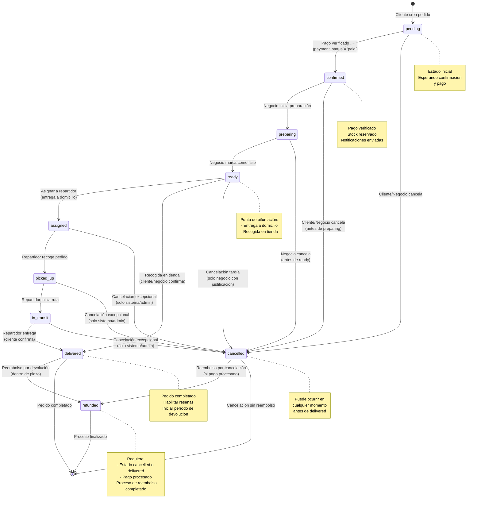

# Diagrama de Flujo - Estados del Pedido

## 📊 Diagrama de Estados del Pedido

Este diagrama muestra todas las transiciones posibles entre los estados de un pedido, incluyendo el flujo normal, cancelaciones y reembolsos.



## 🔄 Flujo Principal (Entrega a Domicilio)

```
[pending] 
    ↓ (Pago verificado)
[confirmed] 
    ↓ (Negocio inicia)
[preparing] 
    ↓ (Negocio marca listo)
[ready] 
    ↓ (Asignar repartidor)
[assigned] 
    ↓ (Repartidor recoge)
[picked_up] 
    ↓ (Repartidor inicia ruta)
[in_transit] 
    ↓ (Repartidor entrega)
[delivered]
```

## 🏪 Flujo Alternativo (Recogida en Tienda)

```
[pending] 
    ↓ (Pago verificado)
[confirmed] 
    ↓ (Negocio inicia)
[preparing] 
    ↓ (Negocio marca listo)
[ready] 
    ↓ (Cliente/Negocio confirma recogida)
[delivered]
```

## ❌ Flujo de Cancelación

```
Cualquier estado (excepto delivered, refunded)
    ↓ (Cliente/Negocio/Sistema cancela)
[cancelled]
    ↓ (Si pago procesado → iniciar reembolso)
[refunded]
```

## 💰 Flujo de Reembolso

### Reembolso por Cancelación
```
[cancelled] (con payment_status = 'paid')
    ↓ (Procesar reembolso)
[refunded]
```

### Reembolso por Devolución
```
[delivered]
    ↓ (Cliente solicita devolución dentro de plazo)
[return_requested] → [return_approved] → [return_verified]
    ↓ (Procesar reembolso)
[refunded]
```

## 📋 Tabla de Transiciones Permitidas

| Estado Actual | Estado Siguiente | Requisitos | Quién puede cambiar |
|---------------|------------------|------------|---------------------|
| `pending` | `confirmed` | `payment_status = 'paid'` | Sistema/Negocio |
| `pending` | `cancelled` | - | Cliente/Negocio/Sistema |
| `confirmed` | `preparing` | - | Negocio/Local |
| `confirmed` | `cancelled` | - | Cliente/Negocio |
| `preparing` | `ready` | - | Negocio/Local |
| `preparing` | `cancelled` | - | Negocio |
| `ready` | `assigned` | Repartidor disponible | Sistema/Negocio |
| `ready` | `delivered` | Recogida en tienda | Cliente/Negocio |
| `ready` | `cancelled` | Justificación | Negocio |
| `assigned` | `picked_up` | - | Repartidor |
| `assigned` | `cancelled` | Excepcional | Sistema/Admin |
| `picked_up` | `in_transit` | - | Repartidor |
| `picked_up` | `cancelled` | Excepcional | Sistema/Admin |
| `in_transit` | `delivered` | - | Repartidor |
| `in_transit` | `cancelled` | Excepcional | Sistema/Admin |
| `delivered` | `refunded` | Devolución aprobada | Sistema/Admin |
| `cancelled` | `refunded` | Pago procesado | Sistema/Admin |

## 🎨 Leyenda Visual

- **Flechas negras**: Transiciones normales del flujo
- **Flechas rojas**: Transiciones de cancelación
- **Flechas verdes**: Transiciones de reembolso
- **Notas**: Información adicional sobre estados clave

## 🔍 Estados y sus Características

### Estados Principales

1. **pending**: Estado inicial, esperando confirmación y pago
2. **confirmed**: Pago verificado, stock reservado
3. **preparing**: Pedido en preparación
4. **ready**: Listo para recoger o asignar
5. **assigned**: Asignado a repartidor
6. **picked_up**: Recogido por repartidor
7. **in_transit**: En camino a destino
8. **delivered**: Entregado al cliente
9. **cancelled**: Cancelado (antes de entrega)
10. **refunded**: Reembolsado

### Puntos de Decisión Clave

- **ready**: Bifurcación entre entrega a domicilio y recogida en tienda
- **cancelled**: Puede ocurrir desde cualquier estado antes de `delivered`
- **refunded**: Solo desde `cancelled` o `delivered` con pago procesado

---

**Referencia**: Ver documento completo en `docs/23-proceso-seguimiento-pedidos-postventa.md`

